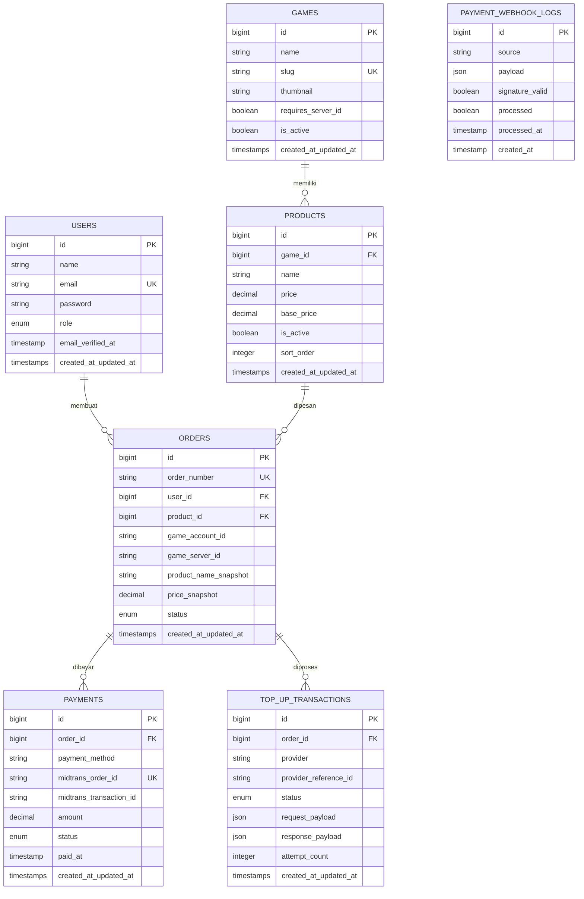

# Entity Relationship Diagram (ERD)

Dokumen ini adalah acuan detail untuk membuat migration Laravel. Setiap
perubahan skema harus diupdate di sini terlebih dahulu sebelum diterapkan
ke migration.

---

## 1. Diagram Relasi



---

## 2. Detail Tabel

### 2.1 `users`

| Kolom | Tipe | Constraint | Keterangan |
|---|---|---|---|
| id | bigint | PK, auto increment | |
| name | string | not null | |
| email | string | unique, not null | |
| password | string | not null | di-hash |
| role | enum('customer','admin') | default 'customer' | |
| email_verified_at | timestamp | nullable | opsional untuk MVP |
| created_at / updated_at | timestamp | | |

---

### 2.2 `games`

| Kolom | Tipe | Constraint | Keterangan |
|---|---|---|---|
| id | bigint | PK | |
| name | string | not null | mis. "Mobile Legends" |
| slug | string | unique, not null | untuk URL, mis. "mobile-legends" |
| thumbnail | string | nullable | path/URL gambar |
| requires_server_id | boolean | default false | menentukan apakah form order butuh input Server ID |
| is_active | boolean | default true | |
| created_at / updated_at | timestamp | | |

---

### 2.3 `products`

| Kolom | Tipe | Constraint | Keterangan |
|---|---|---|---|
| id | bigint | PK | |
| game_id | bigint | FK → games.id, cascade on delete | |
| name | string | not null | mis. "86 Diamonds" |
| price | decimal(12,2) | not null | harga jual saat ini |
| base_price | decimal(12,2) | nullable | harga modal, untuk hitung margin |
| is_active | boolean | default true | |
| sort_order | integer | default 0 | urutan tampil di UI |
| created_at / updated_at | timestamp | | |

---

### 2.4 `orders`

| Kolom | Tipe | Constraint | Keterangan |
|---|---|---|---|
| id | bigint | PK | |
| order_number | string | unique, not null | mis. "ORD-20260923-0001" |
| user_id | bigint | FK → users.id, restrict on delete | |
| product_id | bigint | FK → products.id, restrict on delete | |
| game_account_id | string | not null | User ID akun game tujuan |
| game_server_id | string | nullable | wajib diisi hanya jika `games.requires_server_id = true` |
| product_name_snapshot | string | not null | nama produk saat order dibuat |
| price_snapshot | decimal(12,2) | not null | **harga dikunci saat order dibuat, tidak mengikuti `products.price` yang bisa berubah** |
| status | enum('pending','paid','processing','success','failed','expired') | default 'pending' | lihat state diagram di bawah |
| created_at / updated_at | timestamp | | |

> `restrict on delete` dipilih (bukan cascade) supaya user/produk yang
> sudah punya riwayat order tidak bisa dihapus begitu saja — mencegah
> data transaksi hilang secara tidak sengaja.

**State diagram status order:**

```
pending → paid → processing → success
   ↓         ↓
expired    failed
```

---

### 2.5 `payments`

| Kolom | Tipe | Constraint | Keterangan |
|---|---|---|---|
| id | bigint | PK | |
| order_id | bigint | FK → orders.id, cascade on delete | |
| payment_method | string | nullable | mis. "bank_transfer", "qris" |
| midtrans_order_id | string | unique, not null | dikirim ke Midtrans (biasanya = order_number) |
| midtrans_transaction_id | string | nullable | diisi setelah Midtrans merespons |
| amount | decimal(12,2) | not null | |
| status | enum('pending','settlement','expire','cancel','deny') | default 'pending' | mengikuti status transaksi Midtrans |
| paid_at | timestamp | nullable | |
| created_at / updated_at | timestamp | | |

---

### 2.6 `top_up_transactions`

| Kolom | Tipe | Constraint | Keterangan |
|---|---|---|---|
| id | bigint | PK | |
| order_id | bigint | FK → orders.id, cascade on delete | |
| provider | string | not null | mis. "mock", "apigames" |
| provider_reference_id | string | nullable | ID transaksi dari provider |
| status | enum('pending','success','failed') | default 'pending' | |
| request_payload | json | nullable | payload yang dikirim ke provider |
| response_payload | json | nullable | raw response dari provider |
| attempt_count | integer | default 0 | untuk keperluan retry logic |
| created_at / updated_at | timestamp | | |

---

### 2.7 `payment_webhook_logs`

| Kolom | Tipe | Constraint | Keterangan |
|---|---|---|---|
| id | bigint | PK | |
| source | string | not null | mis. "midtrans" |
| payload | json | not null | raw body webhook yang diterima |
| signature_valid | boolean | default false | hasil verifikasi signature Midtrans |
| processed | boolean | default false | |
| processed_at | timestamp | nullable | |
| created_at | timestamp | | tidak perlu updated_at, log bersifat append-only |

> Tabel ini **wajib** diisi sebelum webhook diproses lebih lanjut, untuk
> menjaga idempotency ketika Midtrans mengirim webhook yang sama lebih
> dari sekali (retry mechanism mereka).

---

## 3. Index yang Perlu Ditambahkan

- `orders.user_id` — untuk query riwayat transaksi per customer
- `orders.status` — untuk query admin dashboard (filter per status)
- `orders.order_number` — sudah unique, otomatis ter-index
- `payments.midtrans_order_id` — sudah unique, otomatis ter-index
- `top_up_transactions.order_id` — untuk lookup cepat status top-up per order

---

## 4. Hal yang Sengaja Tidak Dibuat di MVP

- Tabel `order_items` (asumsi 1 order = 1 produk, tidak ada multi-item
  per order di MVP)
- Tabel `carts` (tidak ada keranjang belanja, langsung checkout per produk)
- Tabel `promotions`/`vouchers`
- Tabel `notifications`