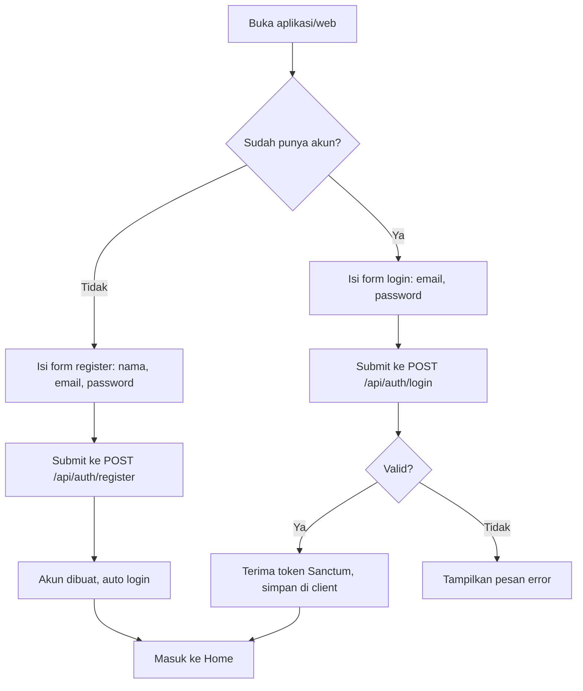
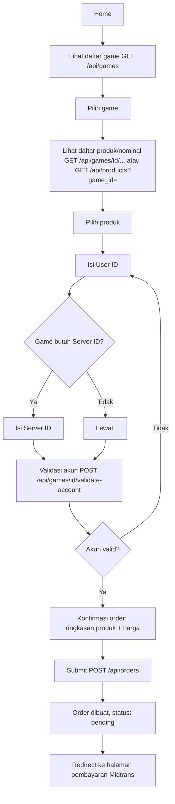
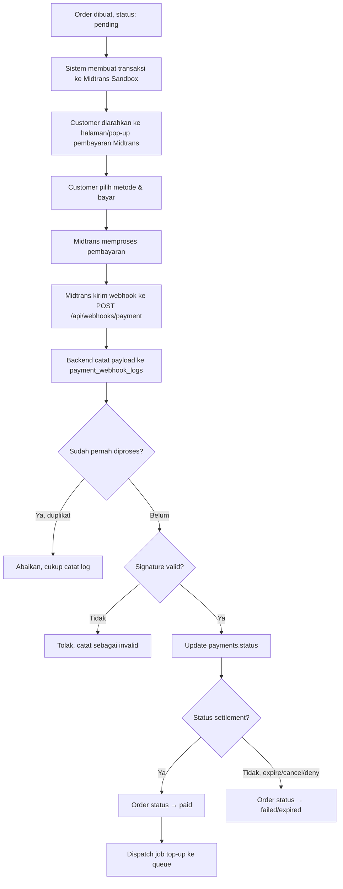
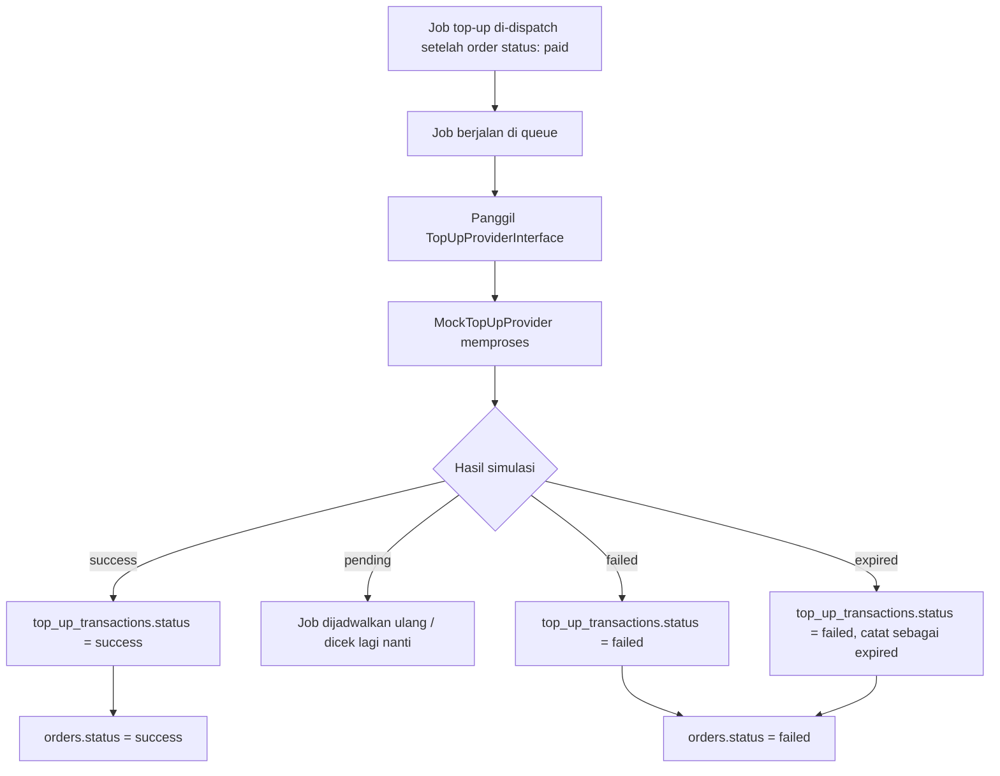
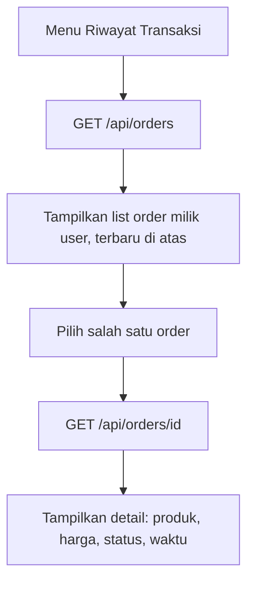
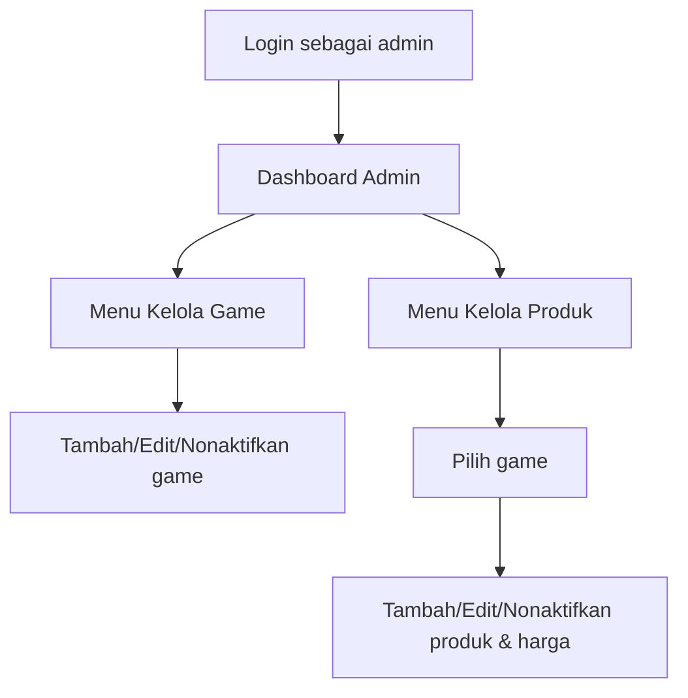
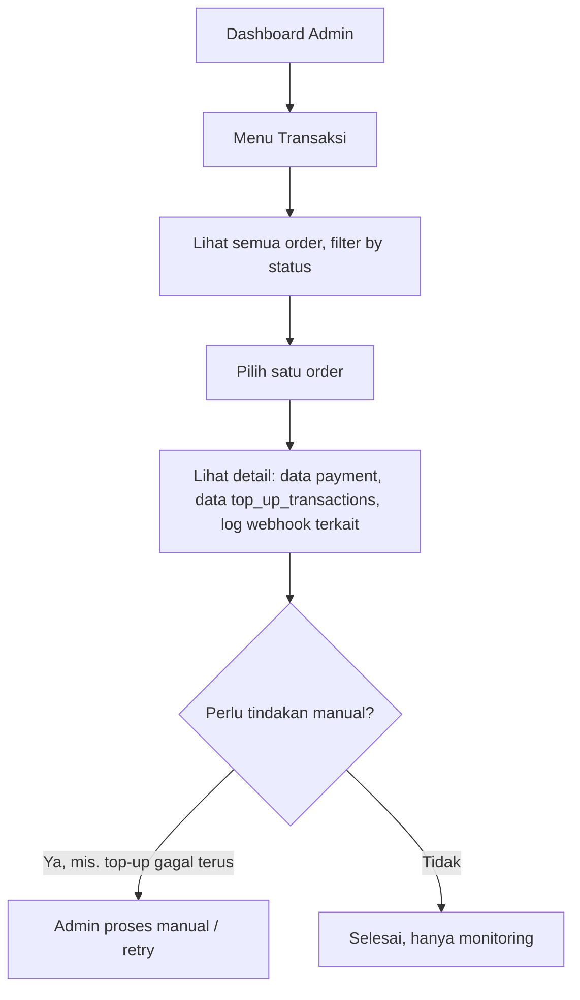

# User Flow

Dokumen ini menjelaskan alur penggunaan sistem dari sisi customer dan
admin, untuk dijadikan acuan saat membangun UI (web & mobile) maupun
endpoint API di backend.

---

## 1. Flow Customer — Registrasi & Login

**Catatan implementasi:**
- Web (Next.js): token disimpan di cookie httpOnly atau memory + refresh strategy.
- Mobile (Flutter): token disimpan lewat Flutter Secure Storage.

---

## 2. Flow Customer — Browsing & Membuat Order

**Catatan:**
- Validasi akun game di MVP bersifat dummy (tidak benar-benar mengecek
  ke server game), tapi tetap melalui endpoint terpisah agar strukturnya
  siap diisi validasi asli di kemudian hari.
- Harga yang ditampilkan di layar konfirmasi harus sama dengan
  `price_snapshot` yang nanti disimpan di order — jangan ambil ulang dari
  `products.price` setelah order dibuat.

---

## 3. Flow Customer — Pembayaran

**Catatan:**
- Langkah G–H adalah mekanisme idempotency — krusial karena Midtrans bisa
  mengirim webhook yang sama lebih dari sekali.
- Customer di sisi client (web/mobile) melakukan polling atau menerima
  update status order setelah kembali dari halaman pembayaran, bukan
  menunggu webhook secara langsung (webhook adalah proses server-to-server).

---

## 4. Flow Sistem — Proses Top-Up (Background Job)

**Catatan:**
- Proses ini berjalan asynchronous lewat Laravel Queue, tidak memblokir
  response ke customer saat pembayaran selesai.
- `attempt_count` di `top_up_transactions` digunakan untuk membatasi
  jumlah retry jika status masih `pending`.

---

## 5. Flow Customer — Melihat Riwayat Transaksi

---

## 6. Flow Admin — Kelola Game & Produk

---

## 7. Flow Admin — Monitoring Transaksi

> Fitur retry manual oleh admin bersifat opsional di MVP — bisa disebut
> di README sebagai "future improvement" jika waktu tidak mencukupi.

---

## 8. Ringkasan Endpoint yang Terlibat per Flow

| Flow | Endpoint Utama |
|---|---|
| Register/Login | `POST /api/auth/register`, `POST /api/auth/login` |
| Lihat game & produk | `GET /api/games`, `GET /api/games/{game}`, `GET /api/products` |
| Validasi akun | `POST /api/games/{game}/validate-account` |
| Buat order | `POST /api/orders` |
| Lihat riwayat order | `GET /api/orders`, `GET /api/orders/{order}` |
| Inisiasi pembayaran | `POST /api/payments` |
| Webhook pembayaran | `POST /api/webhooks/payment` |